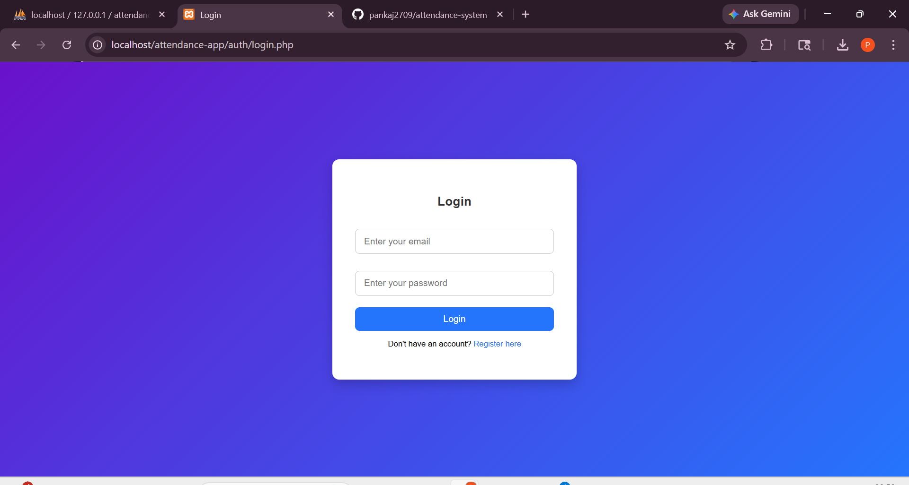
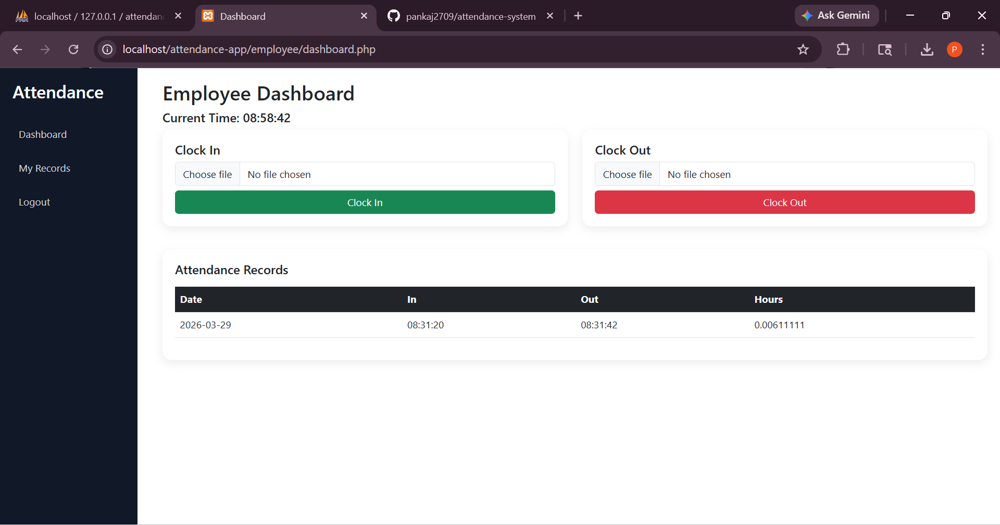
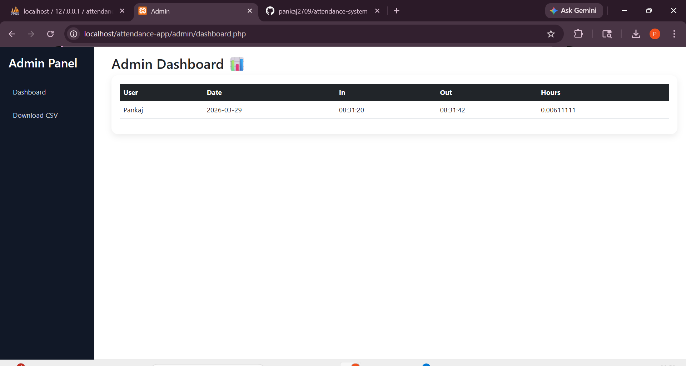

# ⏱️ Time & Attendance System

A modern web-based attendance tracking system with selfie-based clock-in and clock-out, built using PHP and MySQL.

---

## 🚀 Features

- 👤 Employee Registration & Login
- 🔐 Admin Login & Dashboard
- 📸 Selfie-based Clock-In / Clock-Out
- 🗓️ Attendance Tracking with Date & Time
- 📊 Admin Panel with Search & Filters
- 📥 CSV Export for HR
- 📱 Responsive Design (Mobile + Desktop)

---

## 🛠️ Tech Stack

- Frontend: HTML, CSS, JavaScript, Bootstrap
- Backend: PHP 8+
- Database: MySQL
- Hosting: cPanel

---

## 📸 Screenshots

### 🔐 Login Page


### 📊 Employee Dashboard



### 🛠️ Admin Panel


----------------------------------------------------------------------------------------------------

## ⚙️ Setup Instructions

1. Clone the repository:
```bash
git clone https://github.com/pankaj2709/attendance-system.git
